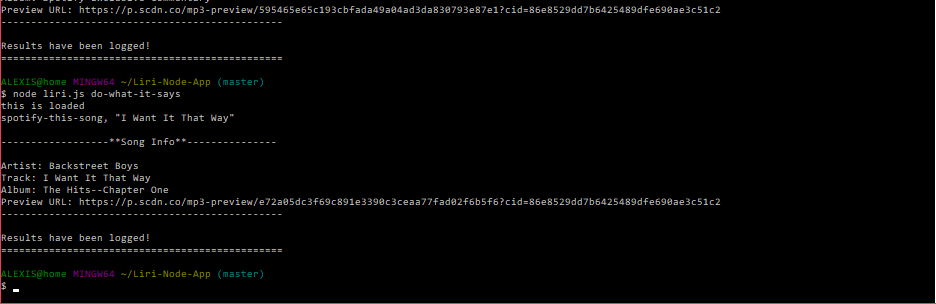

# Liri Bot
### Overview

LIRI is a command line node app that takes in parameters and gives you back data. This app uses the axios NODE package to retrieve data from Bands in Town, OMDB APIs. 

### Packages/Depends:

- Node-Spotify-API
- Axios
- DotEnv
- Moment

To retrieve a listing of upcoming concerts from a specific band/artist enter:

``` node liri.js concert-this <enter in specific band/artist>```


To retrieve song info from your favorite track enter:

``` node liri.js spotify-this-song <enter song>```


To retrieve movie info from your favorite film enter:

``` node liri.js movie-this <enter movie name>```


Bonous command below. Enter and see what it does:

``` node liri.js do-what-it-says```

<<<<<<< HEAD

=======

>>>>>>> f8ca4194394233eaadb910e8d5a264cc36bac978
